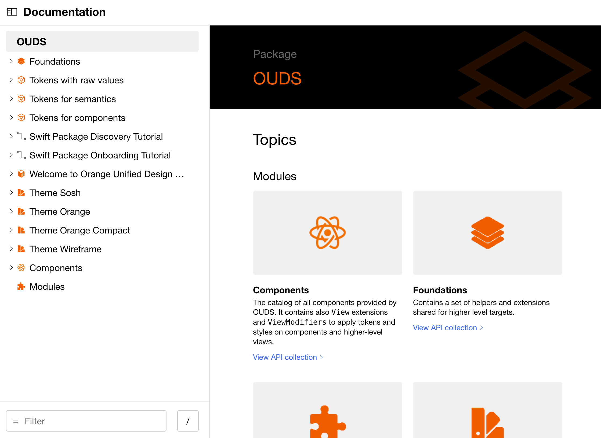
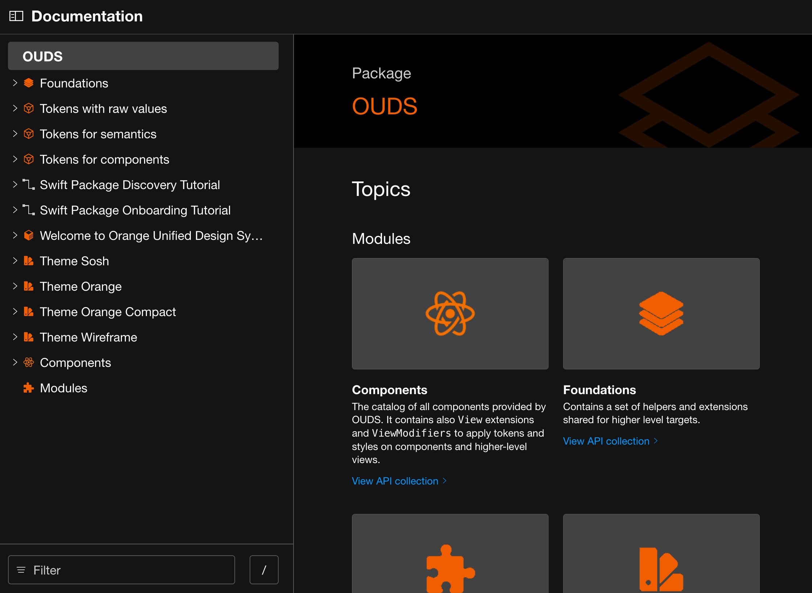

<h1 align="center">OUDS iOS Documentation</h1>

  Technical documentation of the OUDS iOS Swift Package library.
   
  <a href="https://ios.unified-design-system.orange.com/" title="Swift library technical documentation on GitHub Pages">Live documentation</a>
  ·
  <a href="https://github.com/Orange-OpenSource/ouds-ios" title="OUDS iOS Swift Package GitHub project">Swift Package</a>
  ·
  <a href="https://github.com/Orange-OpenSource/ouds-ios-design-system-toolbox" title="Design system toolbox GitHub project">Design system toolbox</a>

## ⚙️ Status

## 📦 Content

> [!NOTE]
> This repository contains only the technical documentation generated from the OUDS iOS Swift Package codebase.

&nbsp;

## 🔒 Data and privacy

The Orange Unified Design System library is a Software Development Kit (SDK) that allows developpers to create Orange branded mobile applications.
As such:
- this SDK does not handle any personnal data
- this SDK does not require any device permission to work

## ⚖️ Copyright and license

Released under the [MIT License](https://github.com/Orange-OpenSource/ouds-ios-documentation/blob/main/LICENSE)